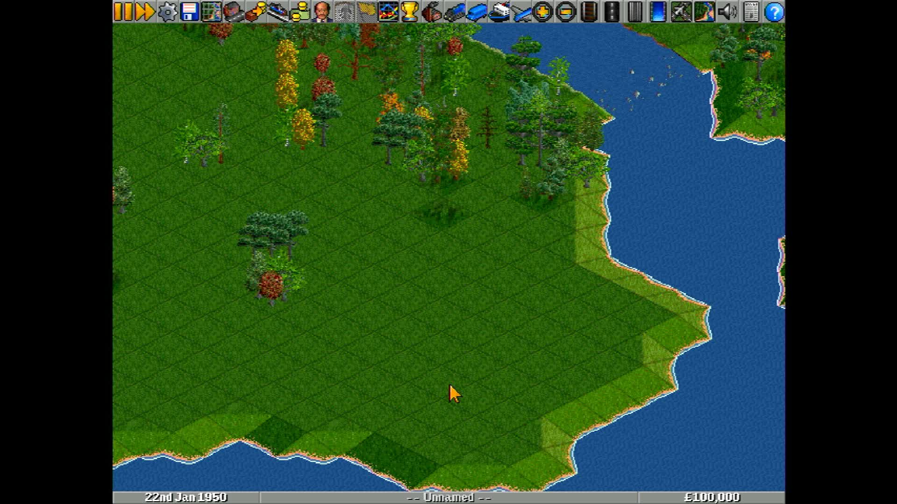

# pi-openttd

**OpenTTD running directly on a Raspberry Pi with no operating system.** The
board powers on and the game is what boots: no Linux, no desktop, no
launcher, and nothing else running beside it.

It builds for the Raspberry Pi 3, Pi 4 and Pi 5, all three from one source
tree.

## What this is

[OpenTTD](https://github.com/OpenTTD/OpenTTD) is an open source
reimplementation of Transport Tycoon Deluxe: a large, modern C++ application
with a simulation running underneath a mouse-driven interface. This
repository is the thin layer that lets it run with nothing underneath: a
[Circle](https://github.com/rsta2/circle) kernel that brings the board up,
and [circle-libsdl2](https://github.com/Xalior/circle-libsdl2), an SDL2
implementation built on Circle's bare-metal drivers.

The game's own source is not copied or modified here. It is a submodule,
pinned at an upstream commit, and the build reads it without ever writing to
it. Where the game needs something the SDL2 layer does not provide, this
repository supplies it in `host/` rather than changing the game.

*Captured from the Pi 5's HDMI output. The board is running this image and
nothing else — no kernel underneath it, no window system, no launcher.*

The game draws into a 640x480 window and the picture is scaled once onto
whatever your screen actually is.

## What works

OpenTTD plays: the map generates, the simulation runs, and the whole
mouse-driven interface works.

- **Picture.** Scaled to your screen.
- **Mouse and keyboard.** Both, which this game needs — it is played almost
  entirely with the mouse.
- **Sound effects.**
- **Saved games.** Written to and read from the SD card.

What is missing:

- **Music.** Sound effects play; the soundtrack does not.
- **Multiplayer, and the in-game content download.** There is no network, so
  the server list and the online graphics, sound and music sets cannot be
  reached. Anything extra has to go on the card by hand.
- **Compressed saves.** Saved games are written uncompressed, so they are
  larger than usual — and a game saved on a desktop cannot be loaded here.
- **PNG screenshots.** They come out as BMP or PCX instead.
- **Complex text shaping.** Text uses OpenTTD's own built-in font, so
  languages needing shaping — Arabic, Hebrew, the Indic scripts — will not
  lay out correctly.

## Building

You need:

- The **Arm GNU toolchain** for the `aarch64-none-elf` target, release
  15.2.Rel1. Put its `bin` directory on your `PATH`, or unpack it into
  `toolchains/`, or set `RAPI_TOOLCHAIN_DIR` to where it lives. See
  `mk/toolchain.mk`.
- **CMake**. OpenTTD generates some of its own sources — the string
  identifiers, the settings table, the script bindings, the revision file —
  with programs that have to run on the machine doing the building. Rather
  than reimplement any of that, this build runs upstream's own CMake once to
  produce them. That is the only thing CMake is used for; the cross build
  itself is plain `make`.
- On **macOS**, GNU `getopt` and a version 5 `bash` from Homebrew. The
  system's own are too old for the dependency build's configure script. The
  makefiles find them if they are installed and say nothing if they are not
  needed.

Then:

    git clone --recursive https://github.com/Xalior/pi-openttd.git
    cd pi-openttd
    make deps          # long: builds newlib and libc++ from source, three times
    make kernels       # all three boards
    make verify        # checks the images exist and are not empty

`make deps` is the expensive step. It configures and builds a separate
[circle-stdlib](https://github.com/smuehlst/circle-stdlib) world for each
board, because the processor, and therefore the C library, differs between
them. Expect it to take a long time on the first run and no time afterwards.
On a machine that cannot hold three worlds at once, `make deps-rpi5` builds
one.

`make rpi3`, `make rpi4` and `make rpi5` build one board each.

The C++ standard used is C++23, not the C++20 upstream asks for. The reason
is the standard library, not the game: the libc++ in these worlds uses a
C++23 construct in its own headers, and GCC rejects it at C++20.

## Game data, and `make media`

**This repository ships no game data, and `make card` never downloads
anything.** OpenTTD needs a graphics set to start at all, and wants a sound
set and a music set.

Two directories, and the difference between them matters:

| | |
|---|---|
| `media/` | Where game data lives on your machine. `make media` downloads into it; you copy your own files into it by hand. It is never committed and never shipped. |
| `build/sd-card/` | What `make card` stages. It copies from `media/` and fetches nothing. |

`make card` works whether or not `media/` has anything in it. A card built
with no data is a real card — it just says plainly which files are missing.

### `make media` — what it downloads

    make media

It downloads three files, with `curl`, all published by the OpenTTD project
at [cdn.openttd.org](https://cdn.openttd.org/):

- **OpenGFX**, the free graphics set — `opengfx-8.0.tar`. OpenTTD refuses to
  start without a graphics set, and this is it.
  `https://cdn.openttd.org/opengfx-releases/8.0/opengfx-8.0-all.zip`.
  Licence: GNU GPL v2.
- **OpenSFX**, the free sound effects set — `opensfx-1.0.3.tar`. The game
  starts without it; it just plays no sound effects.
  `https://cdn.openttd.org/opensfx-releases/1.0.3/opensfx-1.0.3-all.zip`.
  Licence: Creative Commons Attribution-ShareAlike 3.0 Unported.
- **OpenMSX**, the free music set — `openmsx-0.4.2.tar`. The game starts
  without it; it just plays no music, and this port's own music backend is
  disabled regardless — see "No music" above.
  `https://cdn.openttd.org/openmsx-releases/0.4.2/openmsx-0.4.2-all.zip`.
  Licence: GNU GPL v2.

Each set is published as a `.zip` holding one `.tar`. The zip is checked
against the SHA256 published in the release's own `manifest.yaml` on the
same host, then unpacked — OpenTTD reads a `.tar` directly and does not need
it extracted further, so the `.tar` lands in `media/` exactly as unpacked,
checked again against the SHA256 this project computed from it. A
`provenance.txt` is written beside them recording the URLs, the date, the
licences and both sets of checksums. Running it again re-verifies what is
already there instead of downloading it a second time.

### What `make media` will not fetch

**The original Transport Tycoon Deluxe data files**, if you own a copy.
OpenTTD reads them directly. They are a commercial product and are not
distributed by anyone, so nothing here goes looking for them — copy them by
hand, unchanged, into `games/openttd/baseset/` on the staged card, beside the
files `make card` already puts there.

## Putting it on a card

    make card

stages everything into `build/sd-card/`. Copy the contents to a FAT32 card,
then add the one thing the build cannot provide:

- **The Raspberry Pi firmware files** — `bootcode.bin`, `start*.elf`,
  `fixup*.dat` and, for the Pi 4, `armstub8-rpi4.bin` — at the root of the
  card. They come from the
  [Raspberry Pi firmware repository](https://github.com/raspberrypi/firmware).

If `make media` was not run first, `games/openttd/baseset/` is missing the
graphics, sound and music sets, and `make card` says so plainly.

The card ends up looking like this:

    kernel8.img            the Pi 3 image
    kernel8-rpi4.img       the Pi 4 image
    kernel_2712.img        the Pi 5 image
    config.txt             firmware boot configuration, all three boards
    cmdline.txt            kernel options
    games/openttd/         everything the game reads and writes

Every file the game touches is under `games/openttd/`, and nothing of it is
written to the root of the card. That is deliberate: a card can carry several
games, and two of them writing a settings file to the root would each
silently overwrite the other's.

### The thermal settings in `cmdline.txt`

`socmaxtemp=70` is the temperature in degrees Celsius above which the
processor clock is pulled back. Adding `gpiofanpin=<n>` switches a fan on
that pin instead and leaves the clock alone. Both are read by the SDL2 layer,
which owns the clock and the fan.

### Boot options

Every image also carries a 512-byte block at offset 0x800 that a boot loader
can write a command line into before the image runs. Anything written there
is added to the game's own arguments, so a boot can change the resolution or
load a saved game without rebuilding or rewriting the card. Arguments
starting `--rapi-` are the kernel's own and are removed before the game sees
them.

## License

The OpenTTD submodule is licensed under the GNU General Public License,
version 2, and this repository is under the same licence — see `LICENSE`. The
`circle-libsdl2` submodule and the Circle framework beneath it carry their
own licences, stated in their own repositories.

Nothing in this repository is affiliated with or endorsed by the OpenTTD
project.
